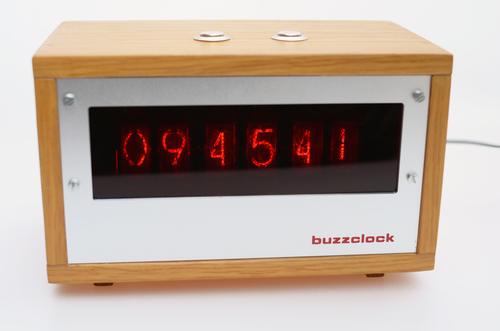

###buzzclock

Nixie clock build on a modified board from [www.tubehobby.com](http://www.tubehobby.com/)

Wooden enclosure courtesy of my father in law. 

###License

[BSD](LICENSE-BSD.txt) for software

[Creative Commons 4.0](LICENSE-CC.txt) for pcb and other artwork

###Copyright

Copyright (c) 2005 Bjoern Seip

